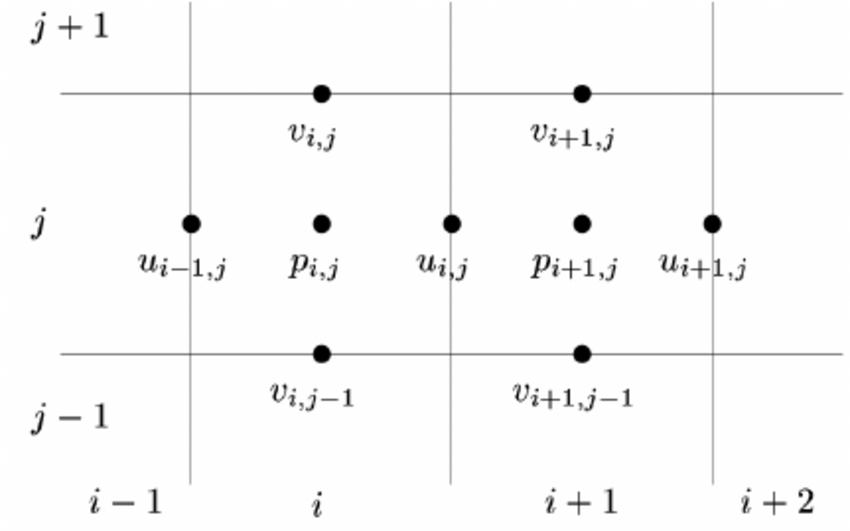
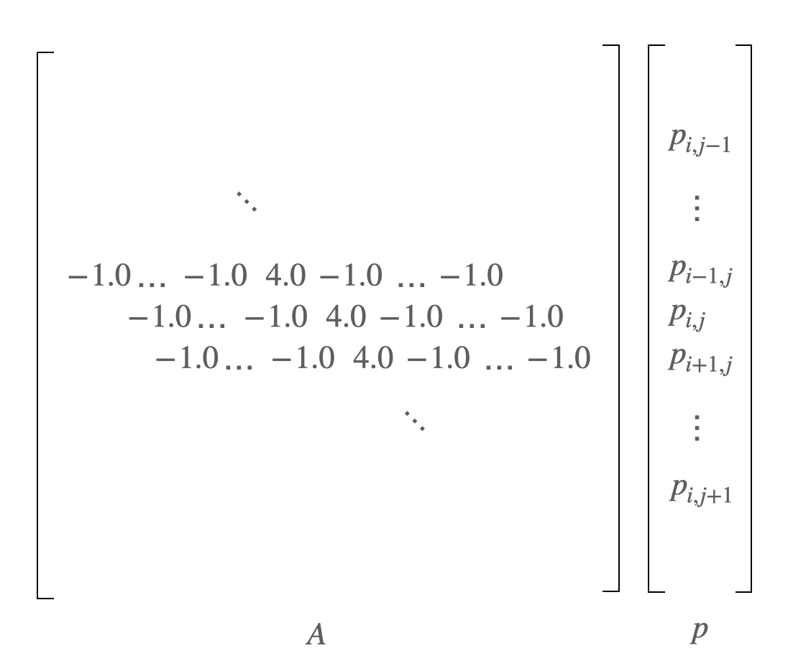
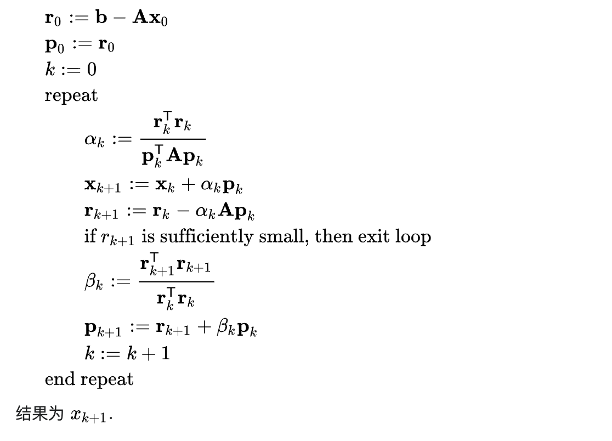

# pku-hpc-taichi-cg

**背景介绍**

在各类数值模拟计算问题中，求解线性方程是一个非常常见且重要的步骤。比如在流体数值计算（CFD）中，我们常常需要求解一个关于流体压力的泊松类型问题：

$$\frac {\delta t}{\rho}\nabla ^2 p = \nabla \cdot \textbf u $$

其中方程的左边是一个压力场 $p$ 的二阶导数，而右边是速度场（矢量）的散度。通常我们想要在已知速度场的情况下，求解其对应的压力场 $p$，在特定的网格设定下，我们可以使用有限差分的方法我们可以将上面的微分方程转化为线性方程组。比如，下图演示了一个流体数值模拟中常用的，将压力存储在网格中心，将速度存储在网格界面上的离散形式：



其对应的离散化方程式是：

$$\frac{\delta t}{\rho}[\frac{1}{dx} \cdot ( \frac{p_{i+1,j} - p_{i,j}}{dx} - \frac{p_{i,j} - p_{i-1,j}}{dx} )+  \frac{1}{dy} \cdot ( \frac{p_{i,j+1} - p_{i,j}}{dy} -  \frac{p_{i,j} - p_{i,j-1}}{dy})] = \frac {u_{i,j} - u_{i-1,j}}{dx} + \frac {v_{i,j} - v_{i,j-1}}{dy} $$

其中 $i$ 和 $j$ 都是 [1, n] 的整数，我们可以对整个计算区域的所有格子列出类似的方程共 $n\times n$个。

对上式稍作整理可以发现当格子大小 $dx = dy$ 时，方程左边可以简化成

$$\frac{\delta t}{\rho dx^2}( 4 p_{i,j} - p_{i+1,j} - p_{i-1,j} - p_{i,j-1} - p_{i,j+1}) $$

其中 $\frac{\delta t}{\rho dx^2}$ 是一个常数系数，为了简化问题我们可以直接将其省略。于是，我们可以将 $p$ 的系数存入一个矩阵 $A$，而将 $p$ 保存在一个向量中，上面的表达式就变成了如下的一个矩阵和向量的乘：



于是这个问题就被转化为了求解线性方程组的问题。在各类数值仿真中，这样的例子还有很多很多。

共轭梯度法（Conjugate-gradient，以下简称为 CG 方法）是一种求解系数矩阵为对称正定矩阵的线性方程组的迭代解法。假设我们要求解如下的线性系统：

$$Ax=b $$

其中 $A$ 是一个对称且正定，大小为 $n \times n $ 的实数矩阵，$x$ 为待求解的大小为 $n \times 1$ 的未知数向量。

整个共轭梯度法的过程可以用伪代码简单描述如下：



其中 $x_k$ 是迭代求解过程中第 $k$ 个循环时的解，$r_k$ 是求解过程中在第 $k$ 个迭代中的残差：

$$r_k = b - A x_k $$

在循环迭代到 $r_k$ 的模小于规定值时即认为求解完成。

**赛题描述**

Taichi 是一门用于高性能并行计算的新型编程语言。我们给出了一个在 Taichi 语言中的 [baseline 实现](https://github.com/houkensjtu/pku-hpc-taichi-cg)，选手的目标是基于这个版本进行进一步的优化。关于 Taichi 语言的细节，选手可以参考 [Taichi 的官方文档](https://docs.taichi-lang.org/) 以及 [Taichi 论坛中的简短介绍](https://forum.taichi-lang.cn/t/topic/3075) 。

仓库中共有两个文件和比赛有关，其中 `cgsolver.py` 包含了求解器的具体实现细节，是选手需要修改的文件；`main.py` 是用于测试结果运算速度和正确性的脚本，原则上不需要选手修改。选手的任务是找出计算中的 bottleneck 并尽量优化加速。


**评测说明**

此次比赛为了方便评测结果，系数矩阵 $A$ 和 $b$ 会事先给定。其中 $A$ 是一个对角线元素为 4.0，其余邻居对应元素为 -1.0 的五对角矩阵。而 $b$ 对应的是一个 2D 的标量场，其值由下式给定：

$$b(x, y) = \sin(2\pi x)\sin(2\pi y) ,\quad (x,y) \in [0,1]\times[0,1]. $$

需要指出，在 baseline 实现中，$b$ 被定义为了一个 2D 且大小为 $n \times n$ 的标量场，其对应的是大小为 $n^2 \times 1$ 的向量，二者元素个数相同，只不过存储形式进行了调整以方便计算 $b$ 中的值。

而系数矩阵 $A$ 在 baseline 中没有显示地给出，而是由 `compute_Ap` 这个 kernel 隐式地定义了 $A$ 的取值。此处选手可根据需要重新组织数据结构，只要结果相同即可。

**评分标准**

将在规定的硬件平台上测算选手的程序，分别对于如下大小规模的问题进行 5 次运行，取平均耗时作为最终结果：

| 测试点 | 未知数数量 | 重复次数 |
| ------ | ---------- | -------- |
| 1      | 256^2      | 5        |
| 2      | 512^2      | 5        |
| 3      | 1024^2     | 5        |
| 4      | 2048^2     | 5        |

运行 repo 中提供的 `main.py` 文件即可进行简单的计时测试以及结果校验：

```bash
$ python3 main.py
```

脚本会自动运行各个测试点的计算，并将 kernel 耗时进行平均后给出。样例输出如下：

```Plain
>>> Current problem size: 256 x 256
>>> Solving Poisson's equation using CG [1/5]
>>> Conjugate Gradient method converged.
>>> Solving Poisson's equation using CG [2/5]
>>> Conjugate Gradient method converged.
>>> Solving Poisson's equation using CG [3/5]
>>> Conjugate Gradient method converged.
>>> Solving Poisson's equation using CG [4/5]
>>> Conjugate Gradient method converged.
>>> Solving Poisson's equation using CG [5/5]
>>> Conjugate Gradient method converged.
*** Average kernel time: 7.295e+02 msec
>>> Checking the residual norm(Ax-b)...
>>> Residual CGPoissonSolver: 9.57e-09
```

其中 `*** Average kernel time:` 后的数字即为选手在此问题上的计时结果（已平均）。
